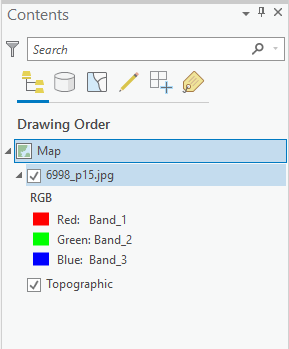

## About
Last Updated *[06/04/2019]*   
Created by [OSU Maps and Spatial Data](https://info.library.okstate.edu/map-room)

## Table of Contents
- Introduction 
- *Georeferencing with ArcPro*
- - Starting a New Project
- - Adding Files
- - Control Points
- - Transforming the Image
- - Saving the Project
- Conclusion
- Further Reading/Resources

## Introduction

Georeferencing is the process of adding geographic information to a raster (or should I just say image?) (i.e. maps, satelite images and aerial photographs) so mapping software can place the image in its real world location. This is done by assigning geographic coordinates to the raster's pixels. 

## *Georeferencing with ArcPro*

#### Starting a New Project

1. To begin a new project, open ArcGIS on your desktop.
2. Click "Map" under "New Blank Templates".
    

3. Name your project and choose a location that will be easy to access (fix wording). Then click "OK". A new screen should open. 

#### Adding Files
Now that a new project has been created, a folder connection must be added in order to import data. 
1. To do this, click "Add Folder" under the "Insert" tab of the Toolbar to create a folder connection.

2. Select the desired folder and click "OK".
3. The folder connection should appear under "Folders" in the Catalog pane. 

4. Locate desired data. Right click the file and click "Add to Current Map". The selected file is now added to the project and should appear in the contents pane. (It is okay if the raster is not displayed on the map as long as the file is visible in the Contents pane.)

Note: For georeferencing, JPGs are the preferred file type. 

#### Georeferencing

Once a file has been added to the project, the georeferencing process can begin. 

1. In order to start georeferencing, you must select the desired file in the contents pane.
2. Click Georeference under the Imagery tab of the Toolbar. A new Georeference tab should appear on the Toolbar. 

3. Click "Fit to Display" under the Georeference tab. If the raster image was not visible before, it should now appear on the map. The size of the image can be adjusted by zooming in or out and clicking "Fit to Display" as needed. (The image does not need to be the exact size of the geographical area it covers. This will be corrected during the georeferencing process.)

 ##### Adding Control Points

#### Transforming the Image

#### Saving the Project

## Conclusion

## Further Reading/Resources

[Return to Top](#about)
